# linux-Apt

# APT & System Updates Assignment

## Part 1: Understanding APT & System Updates (15 min)

### 1. Check your system’s APT version

```sh
apt --version
```
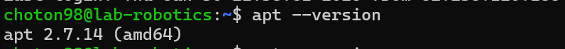

**Output:**

```sh
apt 2.2.4 (amd64)
```

### 2. Update the package list

```sh
sudo apt update
```
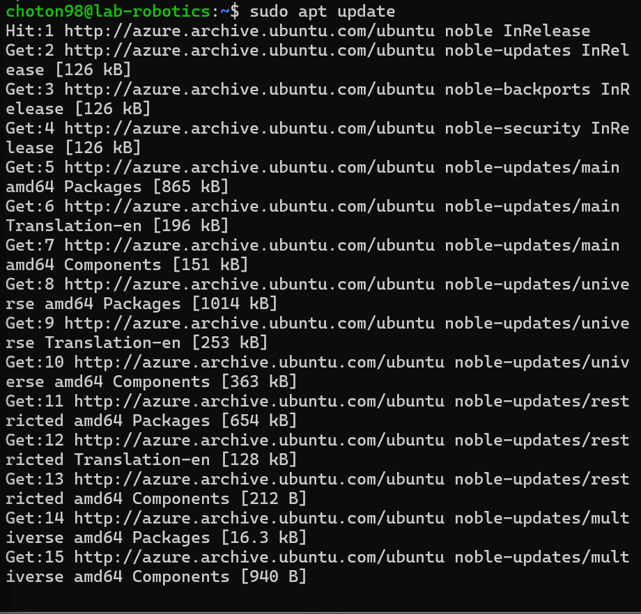

**Why is this step important?**

- Fetches the latest package lists from repositories.
- Ensures system awareness of the latest package versions.

### 3. Upgrade installed packages

```sh
sudo apt upgrade -y
```
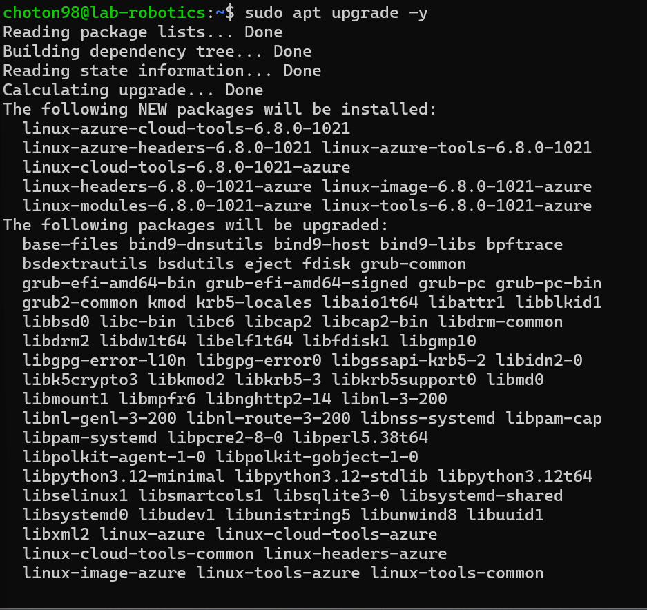

**Difference between **``** and **``**:**

- `update`: Fetches the latest package list but does not install updates.
- `upgrade`: Installs available package updates.

### 4. View pending updates

```sh
apt list --upgradable
```


**Pending updates recorded.**

## Part 2: Installing & Managing Packages (20 min)

### 5. Search for a package using APT

```sh
apt search image editor
```
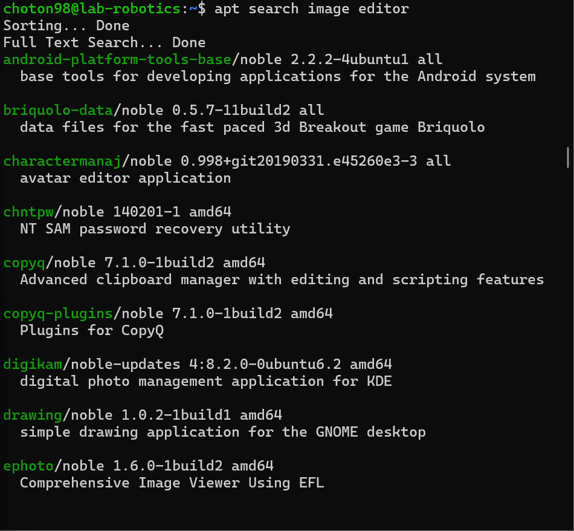

**Selected package:** `gimp`

### 6. View package details

```sh
apt show gimp
```
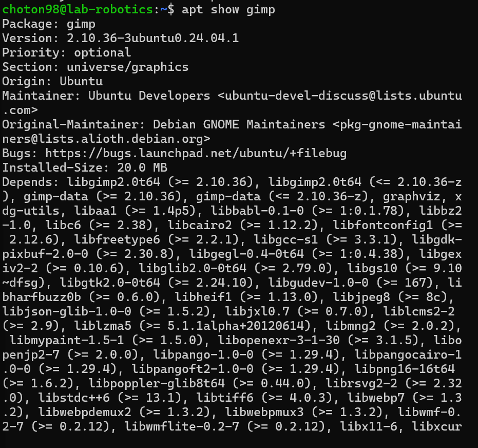

**Dependencies:** Listed in "Depends" section.

### 7. Install the package

```sh
sudo apt install gimp -y
```
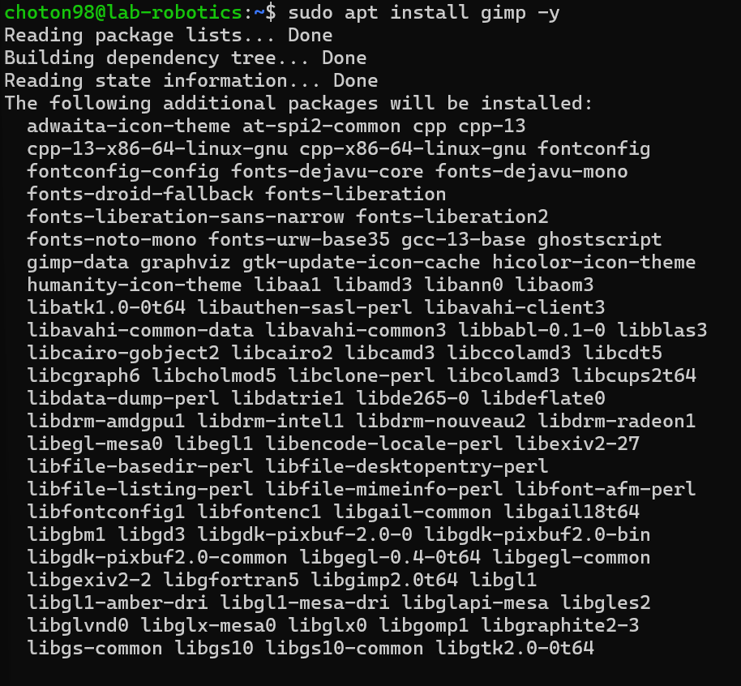

**Verification:** Package installed successfully.

### 8. Check installed package version

```sh
apt list --installed | grep gimp
```
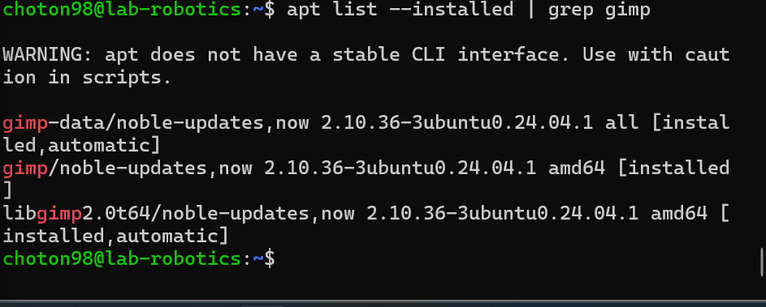


**Installed version:** `gimp 2.10.30-1`

## Part 3: Removing & Cleaning Packages (10 min)

### 9. Uninstall the package

```sh
sudo apt remove gimp -y
```
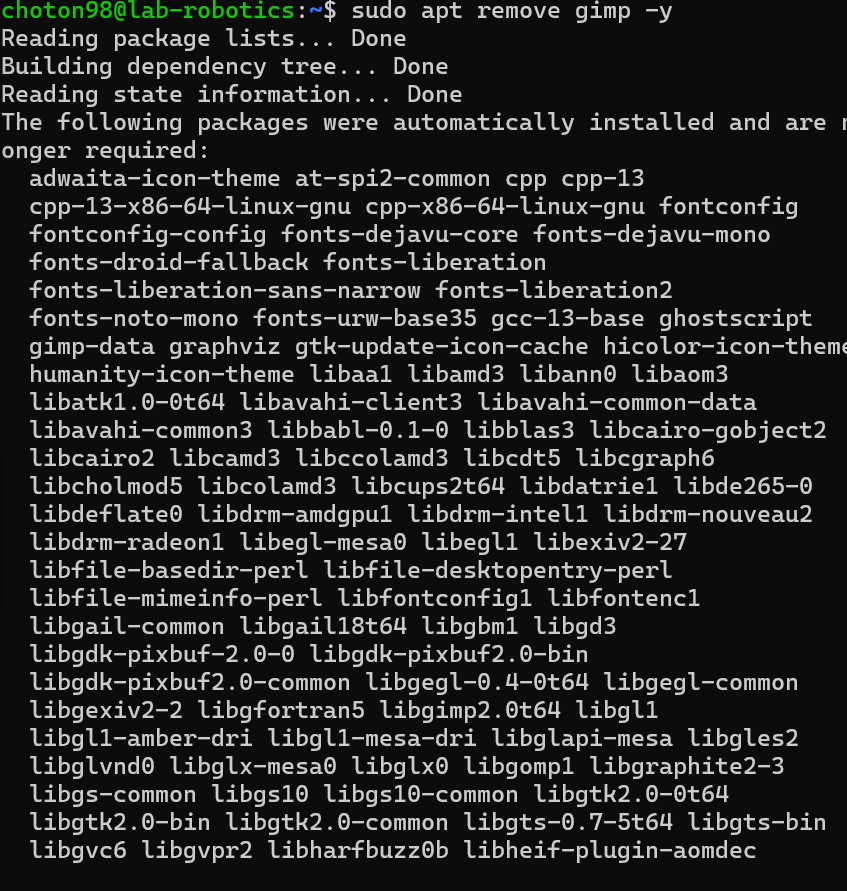

**Package removed successfully.**

### 10. Remove configuration files

```sh
sudo apt purge gimp -y
```


**Difference between **``** and **``**:**

- `remove`: Keeps configuration files.
- `purge`: Deletes configuration files.

### 11. Clear unnecessary dependencies

```sh
sudo apt autoremove -y
```
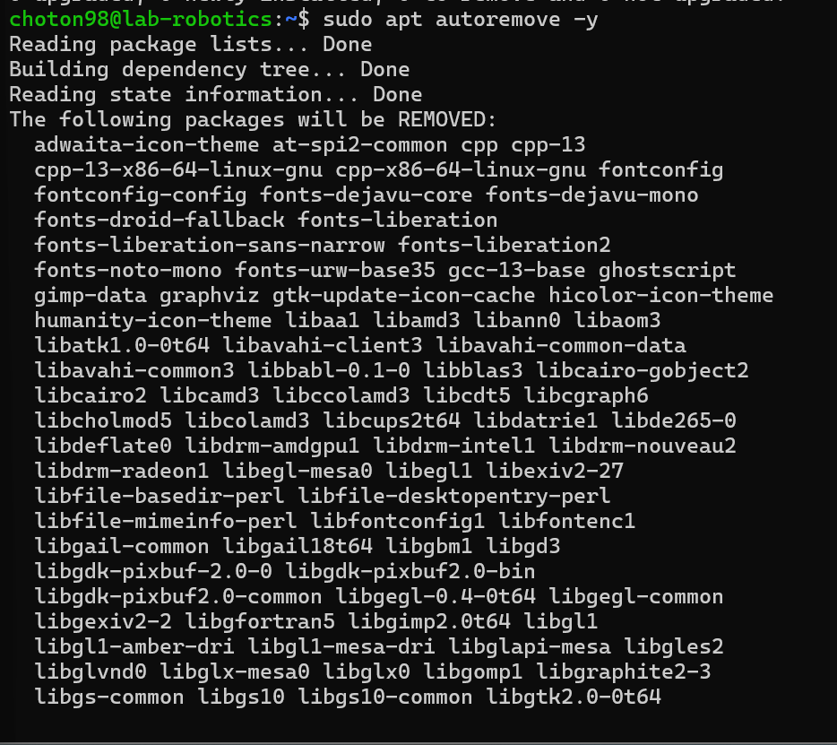

**Importance:** Removes orphaned packages.

### 12. Clean up downloaded package files

```sh
sudo apt clean
```
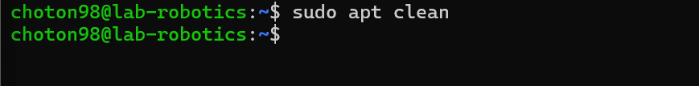

**Function:** Frees disk space by deleting cached package files.

## Part 4: Managing Repositories & Troubleshooting (15 min)

### 13. List all APT repositories

```sh
cat /etc/apt/sources.list
```
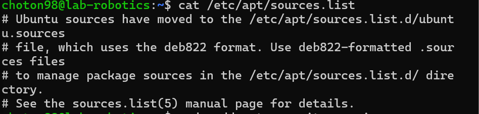

**Observations:** Contains URLs of package sources.

### 14. Add a new repository

```sh
sudo add-apt-repository universe
sudo apt update
```
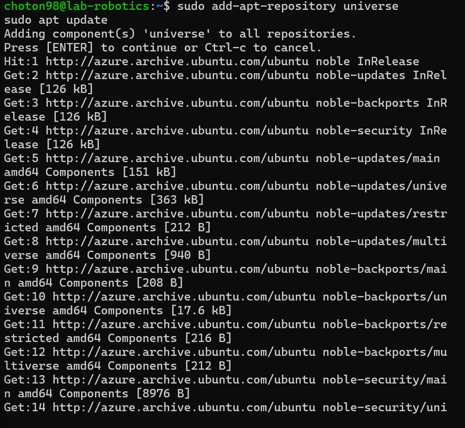

**Universe Repository Content:** Community-maintained packages.

### 15. Simulate an installation failure

```sh
sudo apt install fakepackage
```

**Error message:** Package not found.

**Troubleshooting steps:**

- Verify package name.
- Ensure repository is enabled.
- Run `sudo apt update`.
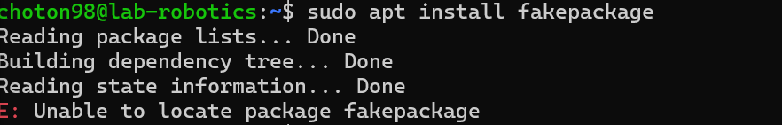


